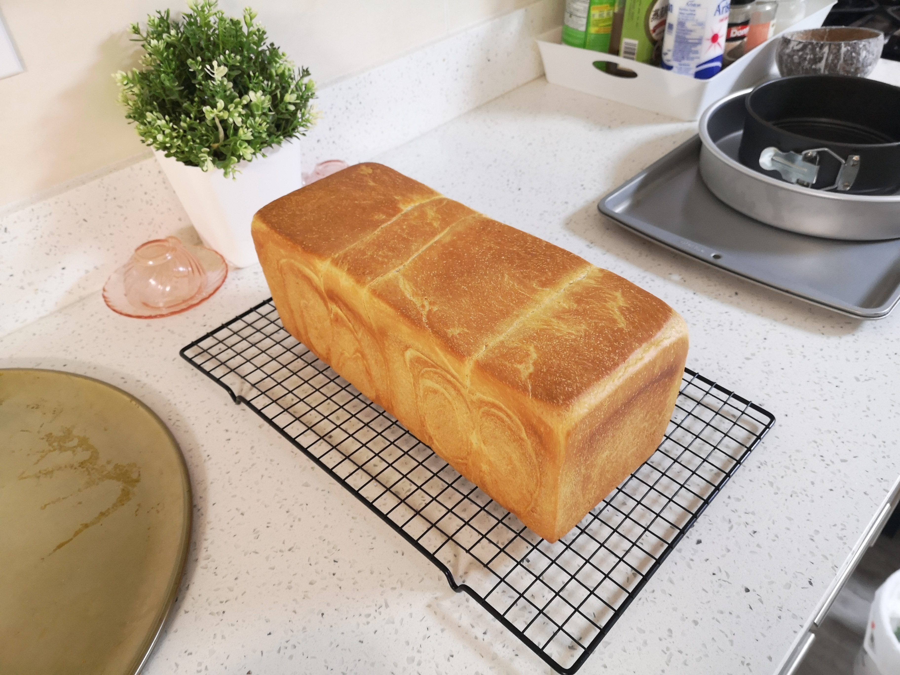

I could:
- Manage enterprise networking & analyze security vulnerabilities
- Manage media files with: FL Studio, After Effects, Premiere, PhotoShop, Audition, ffmpeg, x264, x265, svt-av1
- Develop apps & scripts via Powershell, Shell, Batch, Python, Java, Javascript, C# (Windows Forms)
- Complete functional and pretty UI designs for technical apps
- Database management: mySQL, MSSQL, MongoDB
- IoT programming: Android Studio (Java, empty views project), ESP32 IoT programming (C++)
- Web Programming: ReactJS, React, PHP, webAPI
- Compiling: MSVC, Windows sybsystem for Linux
- Data analysis: Self taught, not professional, but I have some experience from evaluating video encoding results with a few metrics
- Repair any electronics and perform rather complicated cooking and baking, as long as there is a guide
- Build resonably configured custom PCs, virtual machines, android devices and servers

### Game input control QA

Game media values by its controls and interactivity. Here is a non-negotiable, fundamental checklist that covers the basic input elements for games.
All points here are showstopper critical, missing one point means the game is fundamentally broken/unfinished for at least one input type.

| Controller Support        | Requirement                                                                                                                                    | Present (Y/N/-) |
|---------------------------|------------------------------------------------------------------------------------------------------------------------------------------------|-----------------|
| Bounce back mitigation    | The game mitigates joystick bounce back overshoot issue (unintended direction reverse), otherwise the game is totally unplayable on controller |                 |

Strongly Recommended, if development time allows:
- Turn off vibration if the game supports
- Supports both XBOX and PlayStation controller types
- Drift mitigation / center re-calibration sliders
- Deadzone customization

| Mouse Support             | Requirement                                                                                                                                                                                                                  | Present (Y/N/-) |
|---------------------------|------------------------------------------------------------------------------------------------------------------------------------------------------------------------------------------------------------------------------|-----------------|
| Mouse Look                | If the game character turns slowly, then mouse look view is free from character look/aim direction (character catches up to look direction), otherwise the player must move mouse constantly to keep turning (joystick look) |                 |
| Mouse Acceleration toggle | The game demands correct, accurate aiming, and in-game mouse acceleration can at least be turned off                                                                                                                         |                 |
| Mouse Smoothing toggle    | The game demands correct, accurate aiming, and in-game mouse smoothing can at least be turned off                                                                                                                            |                 |
| Mouse Sensitivity         | The game demands correct, accurate aiming, and at least provides mouse sensitivity adjustments                                                                                                                               |                 |
| Mouse-whell Consistency   | Mouse-whell scrolling does not trigger key-press, nor changing game settings, unless the player binds it manually                                                                                                            |                 |

Strongly Recommended, if development time allows:
- Raw mouse input, if demands accurate aiming
- Mouse icon color is enough different from background, or having border/shadow to differentiate

| Keyboard Support             | Requirement                                                                                                                                                                                                                                     | Present (Y/N/-) |
|------------------------------|-------------------------------------------------------------------------------------------------------------------------------------------------------------------------------------------------------------------------------------------------|-----------------|
| Exit Key Consistency         | Exit key (i.e., Esc on keyboard) could exit all menus, dialogs, pause game. i.e., not a second exit key, or a menu with close/cancel button that isn't exit-able by pressing exit key                                                           |                 |
| Logical default key bindings | The game provides a default key-binding that is logically universal (i.e., for FPS and TPS, menu keys are on left side of WASD; weapons, interactions and gadgets are on right side of WASD, etc., unless due to obvious or well-though reason) |                 |

| Universal Control Support                  | Requirement                                                                                                                                                                                                                 | Present (Y/N/-) |
|--------------------------------------------|---------------------------------------------------------------------------------------------------------------------------------------------------------------------------------------------------------------------------- |-----------------|
| Key-blocking Mechanic                      | Input blocking only occurs when visually obvious (e.g., reload animation) or with clear, immediate, and specific audio/visual feedback indicating why and which input is blocked                                            |                 |
| Input-delay Mechanic                       | Minimal delay between input and action. Any intentional delay (e.g., charge attack, charge jump) must be visually obvious and predictable                                                                                   |                 |
| Toggle/Hold Controls                       | State changing key actions (sprint, ADS, crouch, scope, etc.) can be set to Toggle or Hold individually                                                                                                                     |                 |
| Key Remapping                              | The game demands correct, accurate keypress (manuvering, aiming, time-saving), with a working key remapping system (i.e., one key cannot bind to multiple actions, hint key conflict)                                       |                 |
| Dialog fast-forwarding/skipping            | Dialogs can be skipped or fast-forwarded with a key press                                                                                                                                                                   |                 |
| Cutscene pausing/skipping                  | All cutscenes can be either paused or skipped, unless shorter than 10 seconds                                                                                                                                               |                 |
| Action Synchronization                     | All player-controlled action that takes time finishes honestly in the same time, or before the action animation completes                                                                                                   |                 |
| Input Buffer / Priority-of-action Mechanic | The game has enemies that prevents player to complete an action (i.e., reloading, rehealing), implements a reasonable input buffer / pre-input context to cache an pending action, or overrides the current blocking action |                 |
| No Menu Key-blocking                       | No key blocking anywhere in the menu, including menu-animations and startup logos                                                                                                                                           |                 |

Here is an advanced honey lemon-zest brioche 80% hydration sourdough toast:
- 
