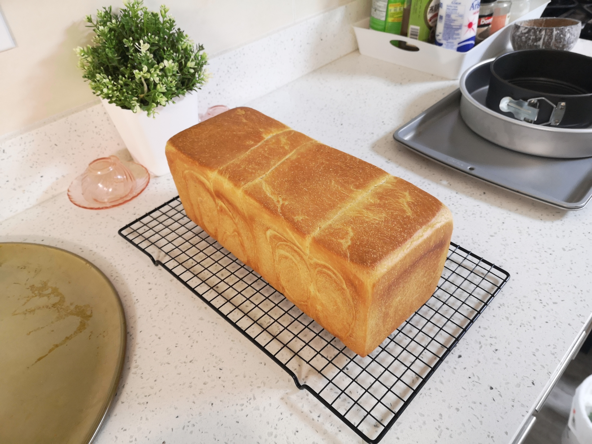

I could:
- Manage enterprise networking & address security vulnerabilities
- Manage Linux, Window Server Core, Cicso IOS, OpenWrt systems
- Professionally handle all sorts of media files w/ professional tools: After Effects, Premiere, PhotoShop, Audition, ffmpeg, ffprobe, x264, x265, svt-av1, FL Studio (music production & mixing)
- Develop apps & scripts via Powershell, Shell/Bash, Batch, Python, Java, C# (Windows Forms, WPF)
- Develop effective designs, mockups, technical docs w/ user friendly, maintainable & stylish look
- Complete functional and pretty UI designs for technical apps
- Develop apps that only use database as source, such as: mySQL, MSSQL, MongoDB
- IoT programming: Android Studio (Java, empty views project), ESP32 IoT programming (C++)
- Web Programming: JS, React, ReactJS, PHP, webAPI, Laravel, NextJS
- Data analysis: Excel, Pyzo (matplotlib + scipy)
- Repair stuffs
- Build custom PCs
- Use Git and GitHub (obviously)

### Game input control QA

Game media values by its controls and interactivity. Here is a non-negotiable, fundamental checklist that covers the basic input elements for games.
All points here are showstopper critical, missing one point means the game is fundamentally broken/unfinished for at least one input type.

| Controller Support     | Requirement                                                                                                                                   | Present (Y/N/-) |
|------------------------|-----------------------------------------------------------------------------------------------------------------------------------------------|-----------------|
| Bounce back mitigation | The game requires quick reactions of player, and mitigates joystick bounce back overshoot issue (unintended direction reverse)                |                 |
| Controller UI          | The UI menus are manipulated via joystick movement, LT/RT triggers, not indirectly manipulated by a cursor moved by joystick (mouse/touch UI) |                 |

**Strongly Recommended, if development time allows:**
- Turn off controller vibration (then consider intensity adjustment)
- Supports both XBOX and PlayStation controller types
- Drift mitigation / center re-calibration sliders
- Joystick angle quantization customization (remap joystick angle to game character angle)
- Deadzone customization to mitigate hardware/driver bugs

| Mouse Support             | Requirement                                                                                                                                                                                                                  | Present (Y/N/-) |
|---------------------------|------------------------------------------------------------------------------------------------------------------------------------------------------------------------------------------------------------------------------|-----------------|
| Mouse Look                | If the game character turns slowly, then mouse look view is free from character look/aim direction (character catches up to look direction), otherwise the player must move mouse constantly to keep turning (joystick look) |                 |
| Mouse Acceleration toggle | The game demands correct, accurate aiming, and in-game mouse acceleration can at least be turned off                                                                                                                         |                 |
| Mouse Smoothing toggle    | The game demands correct, accurate aiming, and in-game mouse smoothing can at least be turned off                                                                                                                            |                 |
| Mouse Sensitivity         | The game demands correct, accurate aiming, and at least provides mouse sensitivity adjustments                                                                                                                               |                 |
| Mouse-whell Consistency   | Mouse-whell scrolling does not trigger key-press, nor changing game settings, unless the player binds it manually                                                                                                            |                 |

**Strongly Recommended, if development time allows:**
- Raw mouse input, if demands accurate aiming
- Mouse icon color is enough different from background, or having border/shadow to differentiate

| Keyboard Support        | Requirement                                                                                                                                                                                                       | Present (Y/N/-) |
|-------------------------|-------------------------------------------------------------------------------------------------------------------------------------------------------------------------------------------------------------------|-----------------|
| Keyboard Sprint         | If the player character can sprint (run or move faster), then keyboard sprint (i.e., hold shift key or other combined input) must be implemented. Not only supporting joystick sprint (push joystick to furthest) |                 |
| Exit Key Consistency    | Exit key (i.e., Esc on keyboard) could exit menus that shows up more than once, pause game. i.e., not a second exit key, or a menu with close/cancel button that isn't exit-able by pressing exit key             |                 |
| Scientific key bindings | Default keybinding has been play-tested by beating the highest action difficulty challenge in the game consistently                                                                                               |                 |

| Universal Control Support                  | Requirement                                                                                                                                                                                                                 | Present (Y/N/-) |
|--------------------------------------------|---------------------------------------------------------------------------------------------------------------------------------------------------------------------------------------------------------------------------- |-----------------|
| Key-blocking Mechanic                      | Input blocking only occurs when visually obvious (e.g., reload animation) or with clear, immediate, and specific audio/visual feedback indicating why and which input is blocked                                            |                 |
| Input-delay Mechanic                       | Minimal delay between input and action. Any intentional delay (e.g., charge attack, charge jump) must be visually obvious and predictable                                                                                   |                 |
| Toggle/Hold Controls                       | State changing key actions (sprint, ADS, crouch, scope, etc.) can be set to Toggle or Hold individually                                                                                                                     |                 |
| Key Remapping                              | The game demands correct, accurate keypress (manuvering, aiming, time-saving), with a working key remapping system (i.e., one key cannot bind to multiple actions, hint key conflict)                                       |                 |
| Dialog fast-forwarding/skipping            | Dialogs can be skipped or fast-forwarded with a key press                                                                                                                                                                   |                 |
| Action Synchronization                     | All player-controlled action that takes time finishes honestly in the same time, or before the action animation completes                                                                                                   |                 |
| Input Buffer / Priority-of-action Mechanic | The game has enemies that prevents player to complete an action (i.e., reloading, rehealing), implements a reasonable input buffer / pre-input context to cache an pending action, or overrides the current blocking action |                 |
| No Menu Key-blocking                       | No key blocking anywhere in the menu, including menu-animations and startup logos                                                                                                                                           |                 |

Here is an advanced honey lemon-zest brioche 80% hydration sourdough toast:
- 
